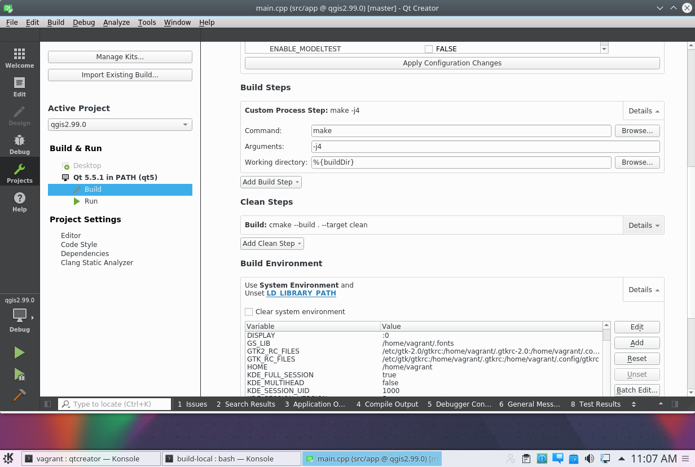

Vagrant recipe for QGIS master build
====================================

This recipe provides a Ubuntu 16.04 VM with everything you need to 
build and run QGIS master with Qt 5.5.1 (3D is not available).

Host setup
----------

The following steps assume you are running Ubuntu 16.04 host.

1. Install Vagrant from: https://releases.hashicorp.com/vagrant/2.0.2/vagrant_2.0.2_x86_64.deb
2. install vagrant plugin: `vagrant plugin install vagrant-disksize`
3. clone this repo `git clone https://github.com/elpaso/qgis-dev-vagrant.git`
4. cd in the repo directory
5. `vagrant up`
6. login into the machine with `vagrant ssh`
7. install guest additions `sudo /vagrant/guest_additions.sh` (answer yes when asked)
8. reboot `vagrant halt && vagrant up`

Usage
-----

After launching the machine with `vagrant up`, you can login with user `vagrant` password `vagrant`.

1. launch `qtcreator.sh` from a console
2. from file menu "Open file or project..." choose `/home/vagrant/QGIS/CMakeList.txt`
3. configure project
4. under "Projects->Build" add a custom process step `make` and type `-j4` in arguments field
5. remove the default build step (qmake)
6. click on the hammer icon to start your build! (and go watch a movie)

Tweaking
--------

The `Vagrantfile` contains some configuration options for VirtualBox VM: you
can customize the disk size, the number of CPUs and the amount of RAM.

Troubleshooting
---------------

If you get a linker error make sure you unset `LD_LIBRARY_PATH` in build environment.

