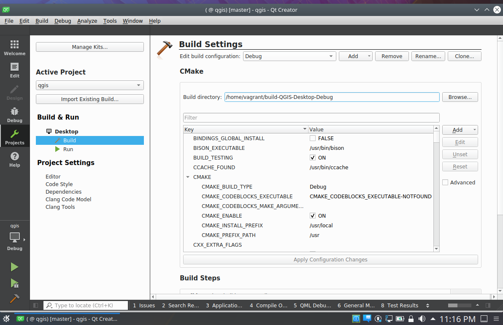

Vagrant recipe for QGIS master build
====================================

This recipe provides a Ubuntu 18.04 VM with everything you need to
build and run QGIS master with Qt Creator.

Host setup
----------

The following steps assume you are running Ubuntu 18.04 host but it should work on any host where Vagrant and VirtualBox can be installed.

1. Install Vagrant from: https://www.vagrantup.com/docs/installation/
2. Install Vagrant plugin: `vagrant plugin install vagrant-vbguest`
3. Install Vagrant plugin: `vagrant plugin install vagrant-disksize`
4. clone this repo `git clone https://github.com/elpaso/qgis-dev-vagrant.git`
5. cd in the repo directory
6. `vagrant up`
7. login into the machine with `vagrant ssh`
8. reboot `vagrant halt && vagrant up`

Usage
-----

After launching the machine with `vagrant up`, you can login with user `vagrant` password `vagrant`.

1. launch QtCreator from the main menu
2. from file menu "Open file or project..." choose `/home/vagrant/QGIS/CMakeList.txt`
3. configure project, choose "Debug" build type
4. apply changes
5. click on the hammer icon to start your build! (and go watch a movie)

Tweaking
--------

The `Vagrantfile` contains some configuration options for VirtualBox VM: you
can customize the number of CPUs and the amount of RAM.

